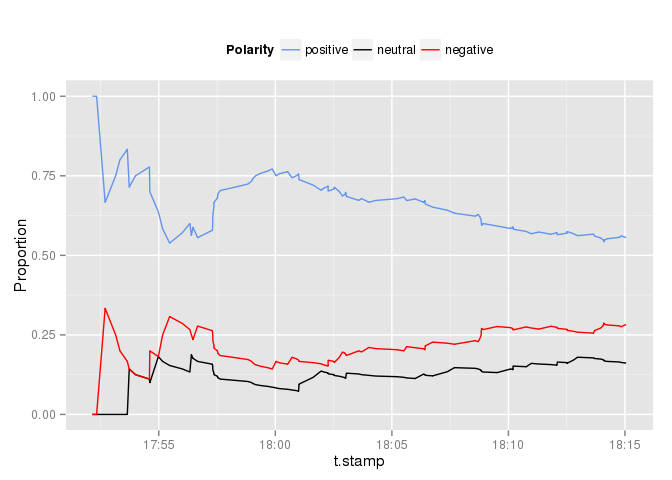
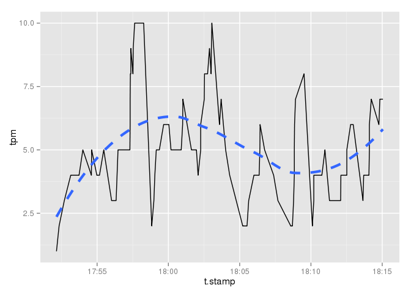

# twitteRStorm
Doug Raffle  


## Overview
The purpose of the stream is to simulate/prototype a streaming framework for a
someone wishing to analyze tweets matching a given topic.

The stream will:

1. Keep track and visualize (with a wordcloud) common terms associated
   with the topic.
2. Classify and visualize the polarity (positive/negative/neutral) of
   tweets and visual common words in each class.
3. Keep track of the proportion of positive tweets as time goes on.
4. Visualize and report the rate of tweets in a given time frame.

## Dependencies
To save some time, here are the install commands for the packages you'll need.  Just run the lines for the packages you don't already have.  Note that the authorization steps I'm using require `twitteR` version 1.1.8, so make sure that package in particular is up-to-date.

```r
install.packages("ggplot2")  
install.packages("RStorm")  
install.packages("twitteR")  
install.packages("wordcloud")  
install.packages("dplyr")  
install.packages("tidyr")  
install.packages("RColorBrewer") 
```

Unfortunately, the `sentiment` package and one of its dependencies has been archived, and I haven't found any other pre-trained polarity classifiers.  To install them from the archive, use these lines:


```r
install.packages("tm")
#### FOR NON-WINDOWS USERS
install.packages("http://www.omegahat.org/Rstem/Rstem_0.4-1.tar.gz",
	             repo = NULL, type = "source")

#### FOR WINDOWS USERS IN RSTUDIO
install.packages("RStem")

#### For everyone
install.packages("http://cran.r-project.org/src/contrib/Archive/sentiment/sentiment_0.2.tar.gz",
	             repo = NULL, type = "source")
```


Once all the packages are install, we can load the libraries.


```r
library(ggplot2)  ## for plots
library(RStorm)  ## for topology
library(twitteR)  ## to get tweets
library(sentiment)  ## to classify polarity
library(wordcloud)  ## to draw word/comparison cloud
library(dplyr)  ## data management
library(tidyr)  ## piping operators for, well, tidyness.
library(RColorBrewer) ## for color palettes
```

## Getting Tweets
### Authorizing `twitteR`
In order to search for tweets with `twitteR`, you need to have a valid Twitter account to obtain authorization credentials.
To start, you will need to enter your consumer key and secret and access token and secret, then call
`setup_twitter_oath()` with these strings.  To get your access key,
secret, and tokens: 

1. Have a valid Twitter Account
2. Go to [https://apps.twitter.com/](https://apps.twitter.com/) and sign in
3. Click `Create New App` if you don't already have one
4. You can fill in dummy values for Name, Description, and Website
5. Once you're in your App, click on `Keys and Access Tokens`
6. Your consumer keys should already exist.  Click `Create my access token` for the access token and secret.
7. Copy and paste the key, token, and secrets into the following code:


```r
consumer.key <- '**********'
consumer.secret <- '**********'
access.token <- '**********'
access.secret <- '**********'
setup_twitter_oauth(consumer.key, consumer.secret,
                    access.token, access.secret)
```


```
## [1] "Using direct authentication"
```


### Searching for Tweets
`twitteR` can search for recent tweets using Twitter's REST APIs.

Once `twitteR` is authorized, we can search for tweets matching whatever keyword we want.  I'll use Comcast, but feel free to use whatever search parameters you prefer.  Note that `searchTwitter()` won't necessarily be able to find as many tweets as we want, becasue the REST APIs will only return recent results.  During the tutorial, you'll probably want to keep $n$ small.


```r
tweet.list <- searchTwitter(searchString = "comcast", n = 500, lang = "en")
tweet.df <- twListToDF(tweet.list)
colnames(tweet.df)
```

```
##  [1] "text"          "favorited"     "favoriteCount" "replyToSN"    
##  [5] "created"       "truncated"     "replyToSID"    "id"           
##  [9] "replyToUID"    "statusSource"  "screenName"    "retweetCount" 
## [13] "isRetweet"     "retweeted"     "longitude"     "latitude"
```

```r
dim(tweet.df)
```

```
## [1] 500  16
```

Note that `searchTwitter()` will put the most recent tweets at the top of the `data.frame`, so we'll want to reverse it to simulate tweets arriving in realtime.


```r
tweet.df <- tweet.df[order(tweet.df$created),]
```

## Setting up the Topology
Now that we have a `data.frame` of tweets, we can use these to simulate an `RStorm` topology.  From here, we will build the following bolts to simulate how a stream would look like:

Bolt | Purpose
-----|-------------
`track.rate()` | Calculate and track tweets per minute over time
`get.text()` | Extract text from tweet
`clean.text()` | Clean special characters, links, punctuation, etc.
`strip.stopwords()` | Clean conjunctions, prepositions, etc.
`get.word.counts()` | Create and update word counts
`get.polarity()` | Classify polarity of a tweet
`track.polarity()` | Track percentage of positive/negative/neutral tweets over time
`store.words.polarity()` | Store words for each polarity level

We will need the following hashes and trackers to calculate and track our results:

`data.frame` | Role | Description
-------------|------|---------------
`comcast.df` | Spout | Table to simulate tweets 
`word.counts.df` | Hash | Stores word frequencies
`t.stamp.df` | Hash | Store unique time stamps
`tpm.df` | Tracker | Track tweets per minute over time
`prop.df` | Tracker | Track percentage of each polarity over time
`polarity.df` | Hash | Store word counts per polarity (term document matrix)
`polar.words.df` | Hash | Keep track of words associated with each polarity

The topology's general structure is:


### The Spout
The `data.frame` `tweet.df` will be used to simulate tweets arriving in realtime.  In `RStorm`, we start the topology by specifying the spout.


```r
topo <- Topology(tweet.df[1:100,])
```

```
## Created a topology with a spout containing  100 rows.
```

### The Bolts
Before writing any bolts, we need to change one `R` option.  By default, `R` treats strings as factors when creating `data.frames`.  Since several of our bolts will be performing string manipulations, and `RStorm` passed tuples as `data.frames`, turning this behavior off will save us several unnecessary type conversions.


```r
options(stringsAsFactors = FALSE)
```

#### Bolt 1: `track.rate()`
Our first bolt, `track.rate()` calculates the tweets per minute (tpm) every time we see a new tweet.  We accomplish this task in two main steps:

1. First, we extract the time stamp from the current tweet and add it to a hash which keeps track of all time stamps called `t.stamp.df`.  Because we will need to read this `data.frame` within the topology, we cannot use a tracker.
2. Once we've stored the time stamp, we used the time stamp `data.frame` to calculate the tpm.  We figure what the cut-off is for the last minute, and simply count the tweets which occur in this range.  If we aren't a minute into the stream, we just count the number of tweets we've seen so far.  This rate is then tracked in `tpm.df`.

Once we've tracked the tpm rate, we simply close the function, since no bolts are downstream.  Finally, we create a bolt from the function which listens to the spout and add it to the topology.


```r
track.rate <- function(tuple, ...){
    t.stamp <- tuple$created
    ## track current time stamp
    t.stamp.df <- GetHash("t.stamp.df")
    if(!is.data.frame(t.stamp.df)) t.stamp.df <- data.frame()
    t.stamp.df <- rbind(t.stamp.df, data.frame(t.stamp = t.stamp))
    SetHash("t.stamp.df", t.stamp.df)
    
    ## get all time stamps and find when a minute ago was
    t.stamp.past <- t.stamp.df$t.stamp
    last.min <- t.stamp - 60
    ## get tpm if we're a minute into the stream
    if(last.min >= min(t.stamp.past)){
        in.last.min <-  (t.stamp.past >= last.min) & (t.stamp.past <= t.stamp)
        tpm <- length(t.stamp.past[in.last.min])
    } else {
        tpm <- length(t.stamp.past)
    }
    TrackRow("tpm.df", data.frame(tpm = tpm, t.stamp = t.stamp))
}
topo <- AddBolt(topo, Bolt(track.rate, listen = 0, boltID = 1))
```

```
## [1] "Added bolt track.rate to position 1 which listens to 0"
```

#### Bolt 2: `get.text()`
This bolt is the simplest in the stream.  Everything downstream of here only needs two pieces of information: the text itself and the time stamp.  All this bolt does is extract these values from the tweet and emit them to the next bolt.

Note that this bolt doesn't depend on `track.rate()`, so it also listens to the spout.


```r
get.text <- function(tuple, ...){
    Emit(Tuple(data.frame(text = tuple$text,
                          t.stamp = tuple$created)), ...)
}
topo <- AddBolt(topo, Bolt(get.text, listen = 0, boltID = 2))
```

```
## [1] "Added bolt get.text to position 2 which listens to 0"
```

#### Bolt 3: `clean.text()`
Our third bolt takes the raw text from `get.text()`, converts it to a more flexible text encoding, forces it to lower case, and strips it of hyperlinks, possesives, special characters, punctuation, and extra whitespace.

These tasks are accomplished using the piping operator from `tidyr` and regular expressions, which gives us much cleaner code.

After the text is clean, we emit the clean text and continue passing the time stamp down the stream.


```r
clean.text <- function(tuple, ...){
    text.clean <- tuple$text %>%
        ## convert to UTF-8
        iconv(to = "UTF-8") %>%
        ## strip URLs
        gsub("\\bhttps*://.+\\b", "", .) %>% 
        ## force lower case
        tolower %>%
        ## get rid of possessives
        gsub("'s\\b", "", .) %>%
        ## strip html special characters
        gsub("&.*;", "", .) %>%
        ## strip punctuation
        removePunctuation %>%
        ## make all whitespace into spaces
        gsub("[[:space:]]+", " ", .)
        
    names(text.clean) <- NULL ## needed to avoid RStorm missing name error?
    Emit(Tuple(data.frame(text = text.clean, t.stamp = tuple$t.stamp)), ...)
}
topo <- AddBolt(topo, Bolt(clean.text, listen = 2, boltID = 3))
```

```
## [1] "Added bolt clean.text to position 3 which listens to 2"
```

#### Bolt 4: `strip.stopwords()`
Because we are focusing on the *meaning* or *semantics* of the tweets, words like conjunctions and prepositions don't tell us any relevant information.  In linguistics, these words are often called *stopwords* or *function words*.  This bolt removes these stopwords words in the SMART stopwords list from the tweets.

We also perform one extra step for safety.  Some tweets, after being stripped of hyperlinks and special characters, **only** contain stopwords.  Once we remove these, we may be left with tweets that are only whitespace or completely empty.  Before emitting a tuple, we do a check to make sure a tweet contains words.  If not, we simply drop the tuple instead of emitting it.


```r
strip.stopwords <- function(tuple, ...){
    text.content <- removeWords(tuple$text,
                                removePunctuation(stopwords("SMART"))) %>%
        gsub("[[:space:]]+", " ", .)
    if(text.content != " " && !is.na(text.content)){
        Emit(Tuple(data.frame(text = text.content,
                              t.stamp = tuple$t.stamp)), ...)
    }
}
topo <- AddBolt(topo, Bolt(strip.stopwords, listen = 3, boltID = 4))
```

```
## [1] "Added bolt strip.stopwords to position 4 which listens to 3"
```

#### Bolt 5: `get.word.counts()`
The fifth bolt does as its name suggests: counts the number of times each word appears.  

We start by splitting the text of the tweet into individual words.  Once we've isolated the words, we load the hash `word.counts.df`.  For our first tweet, this hash won't exist yet, so we need to create it.

After loading the count `data.frame`, we apply through our vector of words and increment the count of words that we've already seen.  If the word is new, we add a new row to the `data.frame` with a count of 1.

Once we've updated our `data.frame` of counts, we overwrite the existing version in the hash.
Since this is the end of a stream branch, we don't need to emit anything.


```r
get.word.counts <- function(tuple, ...){
    words <- unlist(strsplit(tuple$text, " "))
    words.df <- GetHash("word.counts.df")
    if(!is.data.frame(words.df)) words.df <- data.frame()
    sapply(words, function(word){
               if(word %in% words.df$word){
                   words.df[word == words.df$word,]$count <<-
                       words.df[word == words.df$word,]$count + 1
               } else{
                   words.df <<- rbind(words.df,
                                     data.frame(word = word, count = 1))
               }
           }, USE.NAMES = FALSE)
    SetHash("word.counts.df", words.df)
}
topo <- AddBolt(topo, Bolt(get.word.counts, listen = 4, boltID = 5))
```

```
## [1] "Added bolt get.word.counts to position 5 which listens to 4"
```

#### Bolt 6:
Bolt 6, `get.polarity()` listens to `strip.stopwords()`.  The purpose of this bolt is to classify the polarity of a given tweet.  The `classify_polarity()` function implements a Naive-Bayes classifier which uses the polarity of the words in the tweet to predict the polarity of the entire tweet.  For example,


```r
classify_polarity("I love Statistics")
```

```
##      POS                NEG                 POS/NEG            BEST_FIT  
## [1,] "9.47547003995745" "0.445453222112551" "21.2715265477714" "positive"
```

```r
classify_polarity("I hate Statistics")
```

```
##      POS                NEG                POS/NEG             BEST_FIT  
## [1,] "1.03127774142571" "9.47547003995745" "0.108836578774127" "negative"
```

For the given tweet, we classify the polarity and pass the text, time stamp, and polarity down the stream.


```r
get.polarity <- function(tuple, ...){
    polarity <- classify_polarity(tuple$text)[,4]
    Emit(Tuple(data.frame(text = tuple$text,
                          t.stamp = tuple$t.stamp,
                          polarity = polarity)), ...)
}
topo <- AddBolt(topo, Bolt(get.polarity, listen = 4, boltID = 6))
```

```
## [1] "Added bolt get.polarity to position 6 which listens to 4"
```

#### Bolt 7: `track.polarity()`

`track.polarity()` takes the polarity and time stamp from `get.polarity()` and uses them to keep track of the cumulative percentage of tweets of each polarity over time.

We start by getting the `polarity.df` hash, or creating it if it
hasn't been created yet.  After getting the `data.frame`, we increment
the polarity count corresponding to our tweet and the total number
tweets and update the hash of the counts.

Using these, we find the cumulative proportion of tweets with each
polarity and track the fractions.


```r
track.polarity <- function(tuple, ...){
    polarity <- tuple$polarity
    
    polarity.df <- GetHash("polarity.df")
    if(!is.data.frame(polarity.df)){
        polarity.df <- data.frame(positive = 0,
                                  neutral = 0,
                                  negative = 0,
                                  n = 0)
    }
    polarity.df[1, c(polarity, "n")] <- polarity.df[1, c(polarity, "n")] + 1
    SetHash("polarity.df", polarity.df)

    prop.df <- data.frame(cbind(polarity.df[1, 1:3]/polarity.df[1, "n"],
                                t.stamp = tuple$t.stamp))
    TrackRow("prop.df", prop.df)
}
topo <- AddBolt(topo, Bolt(track.polarity, listen = 6, boltID = 7))
```

```
## [1] "Added bolt track.polarity to position 7 which listens to 6"
```


#### Bolt 8: `store.words.polarity()`
The function works similar to `get.word.counts()`, with one extra
caveaut. Instead of having an $n \times 1$ data.frame, we have an `n
\times 3` data.frame, with a column for each polarity. In natural
language processing, we would call this a Term Document Matrix (TDM).
The TDM has a column for each "document" we are examining, in this
case polarity classes.  Then, we have a row for every unique word,
with the values representing the counts within each document.

If we've encountered the word before, we increment the word count in
the column corresponding to the tweet's polarity.

If it is the first time we are seeing a word, we first create a new
row of zeros, add a count of 1 in the correct polarity column,
then bind this row to our existing term document matrix.


```r
store.words.polarity <- function(tuple, ...){
    polar.words.df <- GetHash("polar.words.df")
    if(!is.data.frame(polar.words.df)) polar.words.df <- data.frame()
    
    words <- unlist(strsplit(tuple$text, " "))
    polarity <- tuple$polarity

    sapply(words, function(word){
               if(word %in% rownames(polar.words.df)){
                   polar.words.df[word, polarity] <<-
                       polar.words.df[word, polarity] + 1
               } else {
                   n <- nrow(polar.words.df)
                   this.row <- data.frame(positive = 0, neutral = 0,
                                          negative = 0)
                   this.row[1, polarity] <- 1
                   polar.words.df <<- rbind(polar.words.df,
                                            na.omit(this.row))
                   rownames(polar.words.df)[n + 1] <<- word
               }
           })
    SetHash("polar.words.df", polar.words.df)
}
topo <- AddBolt(topo, Bolt(store.words.polarity, listen = 6, boltID = 8))
```

```
## [1] "Added bolt store.words.polarity to position 8 which listens to 6"
```

## Running the Topology
Now that our bolts are created and added to the topology, we can run the simulation.  Note that, depending on how many tweets you pulled and your processor speed, this may take several minutes.


```r
topo
```

```
## Topology with a spout containing 1500 rows 
##  - Bolt ( 1 ): * track.rate * listens to 0 
##  - Bolt ( 2 ): * get.text * listens to 0 
##  - Bolt ( 3 ): * clean.text * listens to 2 
##  - Bolt ( 4 ): * strip.stopwords * listens to 3 
##  - Bolt ( 5 ): * get.word.counts * listens to 4 
##  - Bolt ( 6 ): * get.polarity * listens to 4 
##  - Bolt ( 7 ): * track.polarity * listens to 6 
##  - Bolt ( 8 ): * store.words.polarity * listens to 6 
## No finalize function specified
```

```r
system.time(result <- RStorm(topo))
```

```
##    user  system elapsed 
## 233.927   5.899 223.496
```

```r
result
```

```
## Name of the stored hashmaps:[1] "t.stamp.df"     "word.counts.df" "polarity.df"    "polar.words.df"
```

## Analyzing the Results
We can get our results by extracting the hashes and trackers from the `result` object.

### Word Frequencies: Word Clouds
The `wordcloud()` function draws a word cloud given a `vector` of words and a `vector` of frequencies, which make up the columns of the hashed `data.frame` `word.counts.df`.

```r
word.df <- GetHash("word.counts.df", result)
words <- word.df$word
counts <- word.df$count
wordcloud(words, counts, scale = c(3, 1), max.words = 100, min.freq = 5, 
          colors = brewer.pal(3, "Set1"))
```

 

### Polarity: Comparison Cloud
We can extract the word lists from `polar.words.df` to build the comparison cloud.


```r
polar.words.df <- na.omit(GetHash("polar.words.df", result))
comparison.cloud(polar.words.df, min.freq = 10, scale = c(3, 1), 
                 colors = c("cornflowerblue", "black", "red"),
                 random.order = FALSE)
```

 

### Polarity over Time
The `prop.df` tracker is used to make a timeplot of the percentages of each polarity over time.  To plot the percentages over time in `ggplot2`, we first need to convert the data from a wide format to a long format.


```r
prop.df <- GetTrack("prop.df", result)
prop.df.long <- prop.df %>% gather(Polarity, Proportion, -t.stamp)
ggplot(prop.df.long, aes(x = t.stamp, y = Proportion, color = Polarity)) +
    geom_line() + theme(legend.position = "top") + 
    scale_color_manual(values = c("cornflowerblue", "black", "red"))
```

 

### Tweet Rate over Time
We stored the rate of tweets per minute in `tpm.df`, in a similar process as polarity over time.


```r
tpm.df <- GetTrack("tpm.df", result)
ggplot(tpm.df, aes(x = t.stamp, y = tpm)) + 
      geom_line()
```

 

Of course, as a matter of safety and good practice, we should set the global `stringsAsFactors` options back to `TRUE`.

```r
options(stringsAsFactors = TRUE)
```


